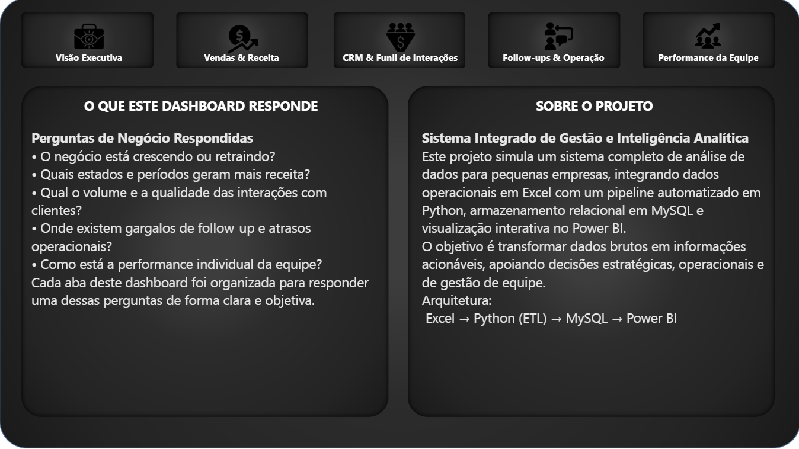
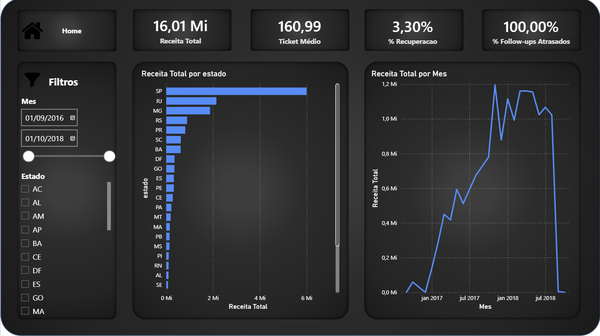
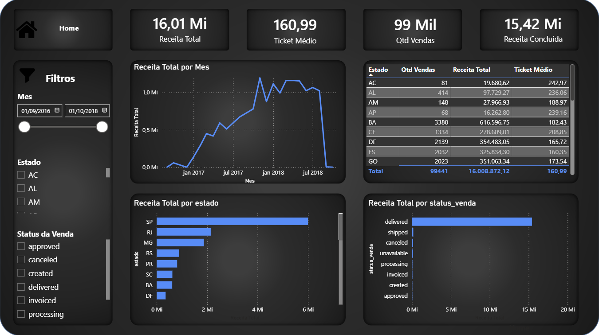
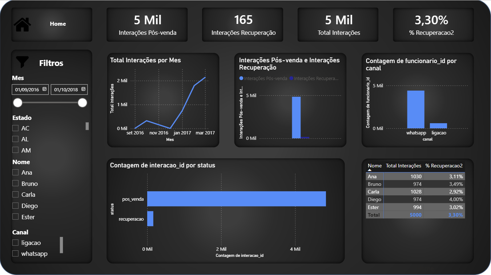
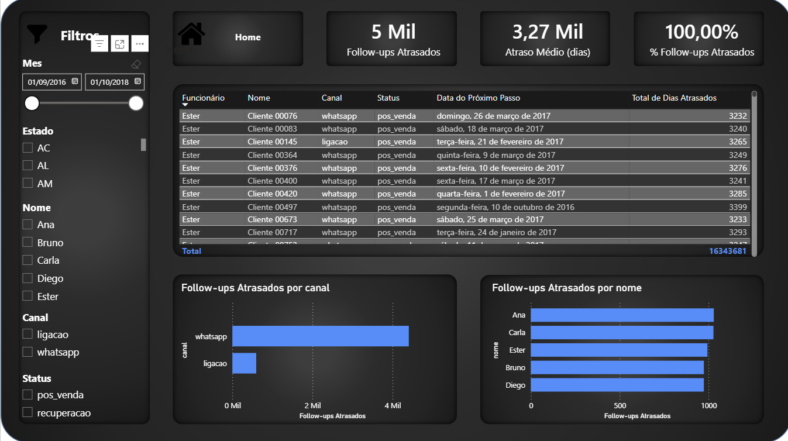
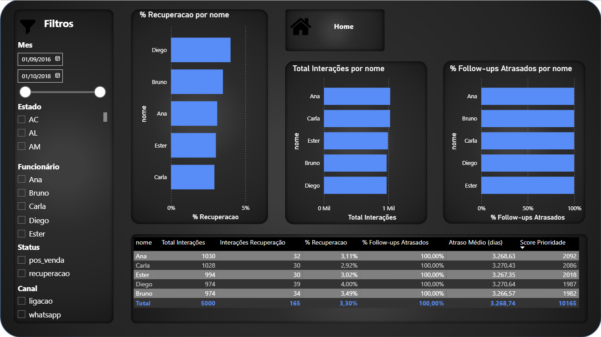

# Sistema Integrado de Gestão e Inteligência Analítica (Excel → Python → MySQL → Power BI)

Projeto de portfólio que simula um sistema completo e escalável para pequenas empresas, partindo de planilhas operacionais e evoluindo para uma arquitetura analítica moderna com automação, integridade relacional e dashboards.

## Objetivo
- Centralizar dados operacionais (Excel) de forma simples
- Automatizar validação e carga (Python/ETL)
- Armazenar dados com integridade e histórico (MySQL)
- Visualizar indicadores e operação (Power BI)
- Permitir crescimento sem retrabalho (Excel pode virar API/ERP no futuro)

## Arquitetura
**Excel (fonte) → Python (ETL) → MySQL (relacional) → Power BI (dashboards)**

## 📊 Páginas do Power BI
- **Home:** navegação e contexto do projeto  
- **Visão Executiva:** KPIs principais (receita, % recuperação, % atrasos)  
- **Vendas & Receita:** evolução temporal e ranking por estado/status  
- **CRM & Funil:** volume e distribuição de interações, canais e tendência  
- **Follow-ups & Operação:** lista de atrasos e backlog por responsável  
- **Performance da Equipe:** ranking por volume, qualidade e backlog  

## Prints
> Adicione as imagens em `docs/images/` e referencie abaixo.









## Modelagem (MySQL)
Tabelas principais:
- `clientes`
- `vendas`
- `funcionarios`
- `interacoes`
- `etl_log` (log de execução)

Views para análises:
- `vw_receita_mensal`, `vw_receita_estado`, etc.

Scripts em: `sql/`

## Como rodar localmente

### 1) Clonar e instalar dependências
```bash
pip install -r requirements.txt
