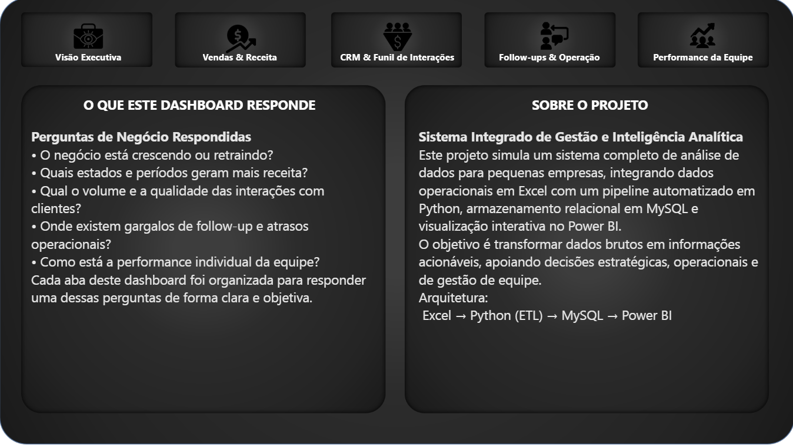
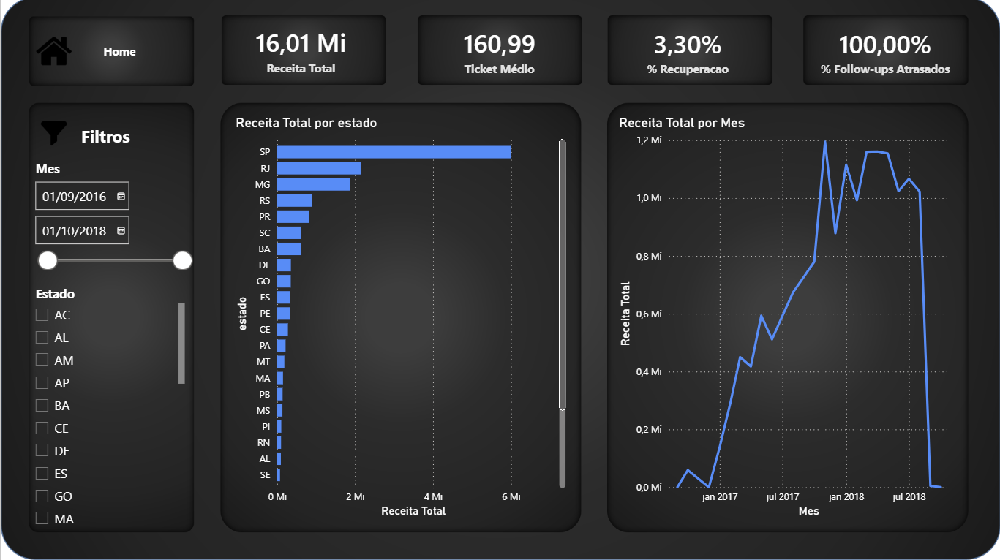
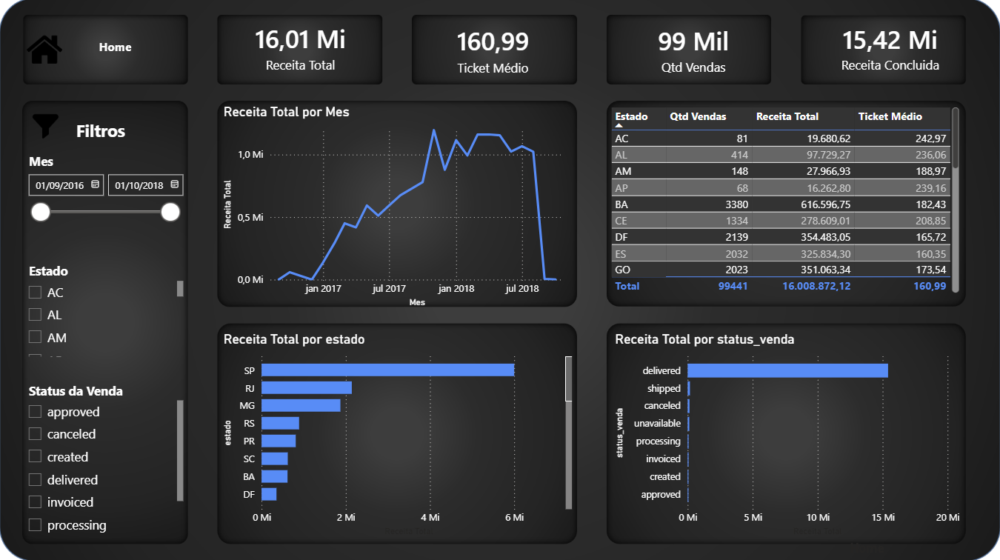
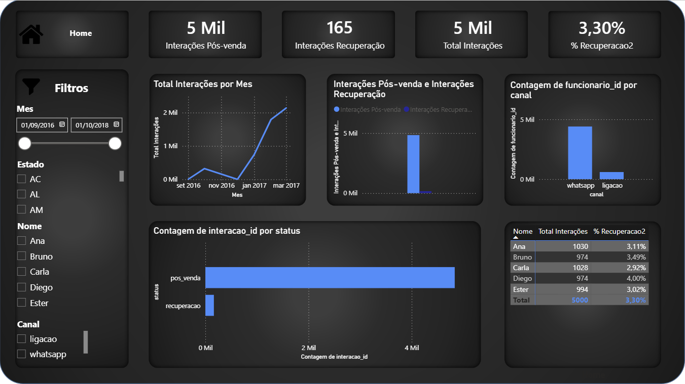
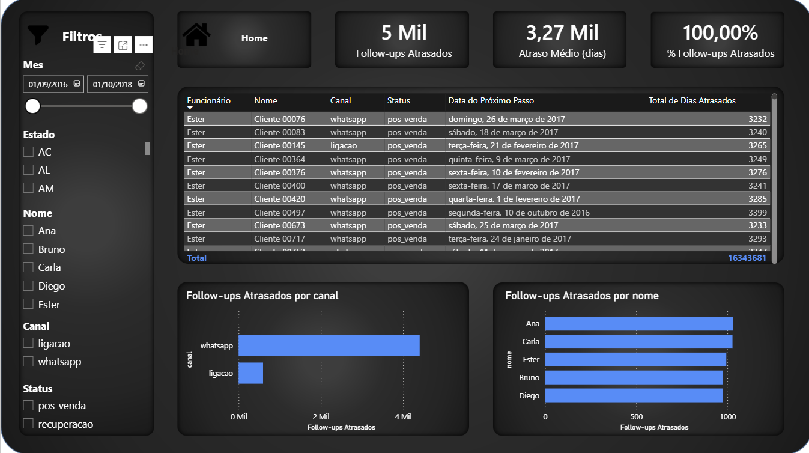
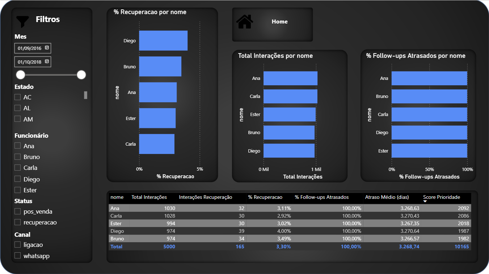
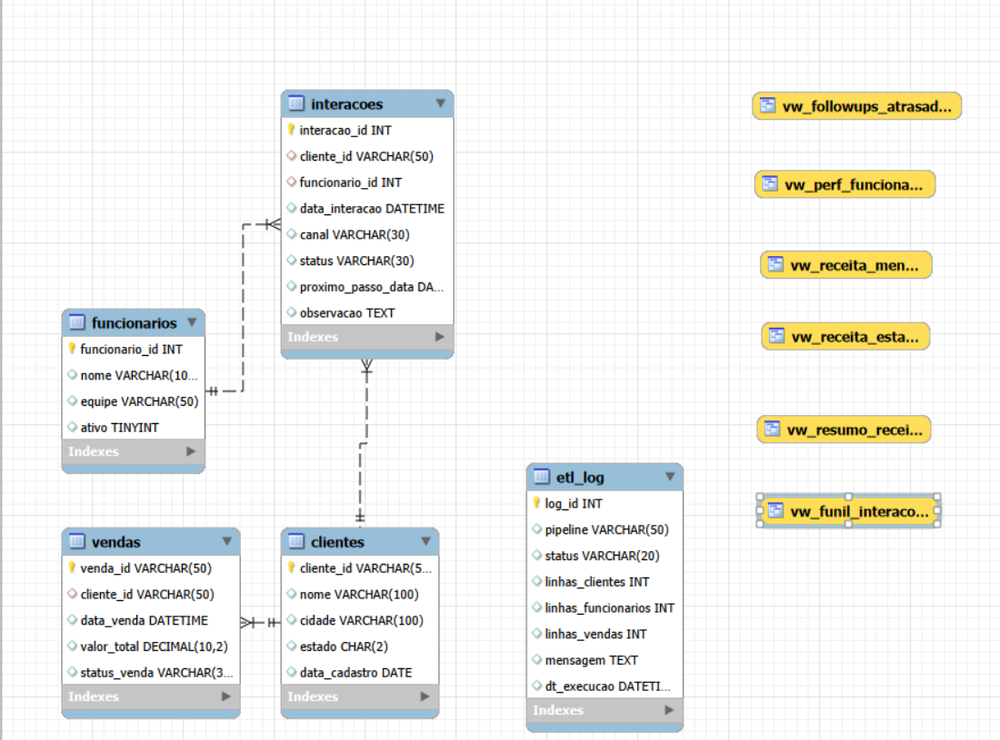
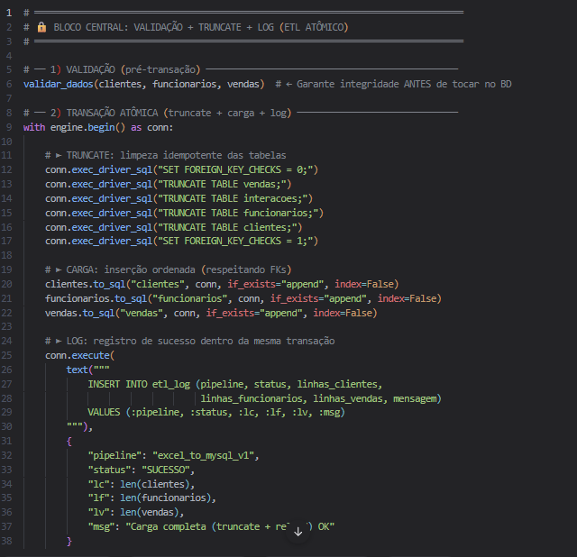

# Sistema Integrado de Gestão e Inteligência Analítica  
### Excel → Python → MySQL → Power BI

Projeto de portfólio que simula um **sistema completo de gestão e inteligência analítica para pequenas empresas**, partindo de planilhas operacionais e evoluindo para uma arquitetura moderna de dados com **ETL automatizado, banco relacional e dashboards interativos**.

---

# 🎯 Objetivo

- Centralizar dados operacionais simples (Excel)  
- Automatizar validação e carga de dados com Python (ETL)  
- Armazenar informações com integridade relacional (MySQL)  
- Gerar dashboards analíticos e operacionais (Power BI)  
- Permitir crescimento do sistema sem retrabalho  

Este projeto demonstra como um negócio pode **evoluir de planilhas para uma arquitetura de dados estruturada**, permitindo decisões baseadas em dados.

---

# 🏗 Arquitetura

**Fluxo de dados do sistema:**

```
Excel (Fonte Operacional)
        ↓
Python (ETL / Automação)
        ↓
MySQL (Banco Relacional)
        ↓
Power BI (Dashboards Analíticos)
```

---

# 📊 Dashboards (Power BI)

O relatório foi estruturado em diferentes camadas de análise:

### Home
Tela inicial com navegação entre as páginas do relatório.



---

### Visão Executiva
KPIs principais para tomada de decisão:

- Receita total
- % recuperação de vendas
- % atrasos operacionais



---

### Vendas & Receita
Análise de desempenho comercial:

- Evolução temporal da receita
- Ranking por estado
- Distribuição por status de venda



---

### CRM & Funil
Monitoramento do relacionamento com clientes:

- Volume de interações
- Distribuição por canal
- Tendência de contato com clientes



---

### Follow-ups & Operação
Gestão operacional do dia a dia:

- Lista de vendas atrasadas
- Backlog por responsável



---

### Performance da Equipe
Avaliação de desempenho da equipe:

- Ranking de funcionários
- Volume de atendimentos
- Qualidade operacional



---

# 🧠 Modelagem de Dados (MySQL)

O banco relacional centraliza os dados operacionais garantindo integridade e histórico.

### Tabelas principais

- `clientes`
- `vendas`
- `funcionarios`
- `interacoes`
- `etl_log` (registro das execuções do ETL)

### Views analíticas

Algumas views criadas para facilitar análises:

- `vw_receita_mensal`
- `vw_receita_estado`
- `vw_performance_funcionarios`

Scripts disponíveis na pasta:

```
sql/
```

### Estrutura do banco



---

# ⚙ ETL e Automação (Python)

O pipeline de dados foi implementado em Python para automatizar o fluxo de dados entre Excel e MySQL.

Funções do ETL:

- Leitura dos dados do Excel
- Validação e padronização
- Limpeza de inconsistências
- Carga no banco MySQL
- Registro de logs de execução

O pipeline foi projetado para **rodar múltiplas vezes sem duplicar dados**.

### Código do ETL



---

# 🗂 Estrutura do Projeto

```
data/        → dados brutos ou amostras(Privado)
docs/images/ → imagens e prints do projeto
etl/         → pipeline Python de ETL
powerbi/     → arquivos ou documentação do dashboard
slides/      → apresentação do projeto(Privado)
sql/         → schema e queries do banco
```

Arquivos principais:

```
README.md
requirements.txt
.gitignore
```

---

# 🖥 Como rodar o projeto localmente

### 1) Instalar dependências

```bash
pip install -r requirements.txt
```

### 2) Configurar conexão com MySQL

Editar as credenciais de conexão no script do ETL.

### 3) Executar o pipeline

```bash
python run_pipeline.py
```

---

# 🚀 Possíveis Evoluções

- Integração com APIs externas
- Automação com Airflow ou Prefect
- Evolução para Data Warehouse
- Deploy em ambiente cloud

---

# 👨‍💻 Autor

**Matheus Marinho**

Projeto de portfólio focado em **engenharia de dados, análise de dados e Business Intelligence**.
